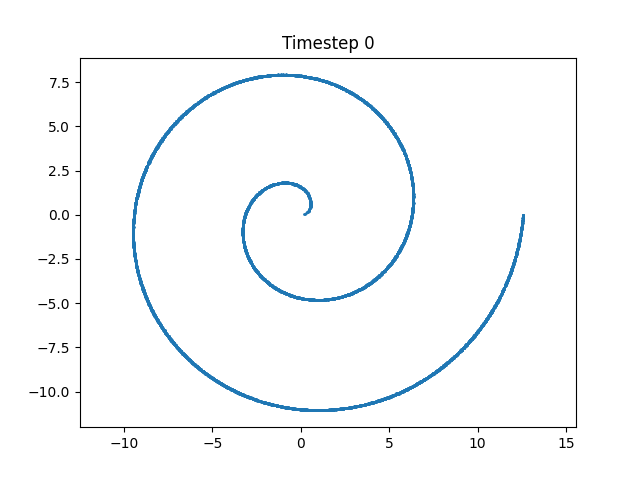
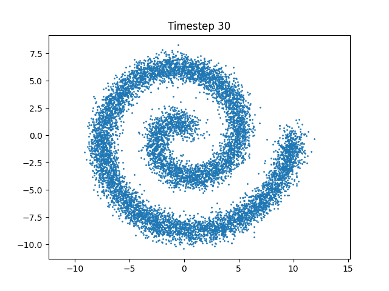
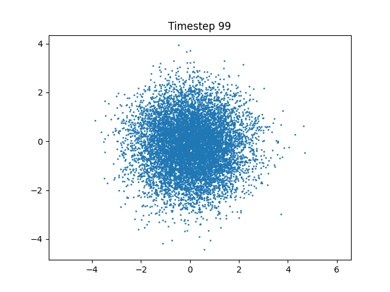
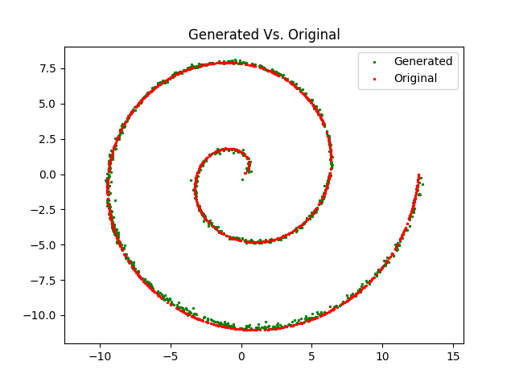

# Diffusion Model on 2D Spiral Data

A minimal and educational implementation of a **denoising diffusion model** on a synthetic 2D spiral dataset.  

---

## Overview

This project demonstrates how diffusion models work by:
1. Creating a clean 2D spiral dataset.
2. Gradually adding Gaussian noise (forward process).
3. Training a neural network to reverse the noise (denoising).
4. Sampling new points from pure noise that reconstruct the original spiral structure.

---

## What's Inside

- `generate_spiral`: Generates a 2D spiral dataset.
- `add_noise`: Applies the forward diffusion process.
- `DenoiseMLP`: A small MLP that predicts the noise at a given timestep.
- `train`: Trains the model to learn denoising.
- `sample`: Performs the reverse diffusion to reconstruct the clean signal.

---

## Visual Examples

### Forward Process (Adding Noise)

| Step 0 | Step 30 | Step 99 |
|--------|---------|---------|
|  |  |  |

### Reverse Process (Sampling)

| Original vs. Generated |
|------------------------|
|  |

---

## Requirements

Install the required Python libraries:

```bash
pip install torch matplotlib numpy
```

---

## How to Run

Run the main Python script:

```bash
python diffusion_example.py
```

This will:
- Generate the spiral dataset
- Apply the diffusion process
- Train the model
- Reconstruct the data via reverse diffusion

---

## Output

- Intermediate scatter plots of noisy samples (at various diffusion steps)
- Training loss curve
- Final comparison: real vs. generated spiral

---

## Key Parameters

| Parameter      | Value            | Description                          |
|----------------|------------------|--------------------------------------|
| `n_steps`      | 100              | Number of diffusion timesteps        |
| `beta_schedule`| linspace(1e-4, 0.1) | Noise added at each step          |
| `epochs`       | 1000             | Training epochs                      |
| `MLP`          | 3 hidden layers  | Denoising network architecture       |

---

## Core Concepts

- `alpha_hat`: Cumulative product of alphas, controls how much of the original signal remains.
- Forward process:  
  `xt = sqrt(alpha_hat[t]) * x0 + sqrt(1 - alpha_hat[t]) * noise`
- Reverse process:  
  The model predicts `noise` from `xt` and timestep `t` to recover the clean signal step-by-step.

---

##  License

MIT License – Free to use, modify, and share. Attribution appreciated

---
